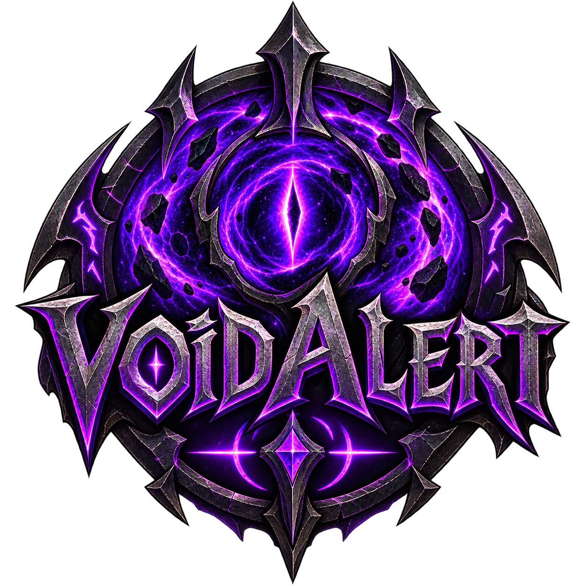

# VoidAlert

World of Warcraft addon (Retail 12.1, Midnight) for **Devourer Demon Hunters**. It plays a sound as soon as

- **Void Metamorphosis** becomes usable (after consuming 50 soul fragments),
- **Collapsing Star** becomes usable (during Void Metamorphosis, with 30 soul fragments), and
- **Soul Immolation** is ready again (on every charge with Tempered Soul, and when Spontaneous Immolation resets it).

Sound only, nothing is shown on the screen.

## Features

- **Three alerts** with their own sound, each can be turned on or off
- **Bundled voice alerts** in English and German; the default follows your client language (German client: German voice, otherwise English)
- **Your own sounds:** up to five files in a separate folder that survives addon updates
- **LibSharedMedia:** every sound registered by other addons can be used, and VoidAlert's own sounds are registered there for other addons
- **WoW sounds:** a few built-in game sounds such as Raid Warning or Ready Check
- **Sound channel:** Master (default), SFX, Dialog, Music or Ambience
- **Only in combat** (on by default)
- **Chat messages** on login and when testing are optional (off by default)
- **Only active for Devourer Demon Hunters;** silent for all other classes and specializations
- **Languages:** English and German

## Installation

Install VoidAlert from [CurseForge](https://curseforge.com/project/1717922) (for example with the CurseForge app), or download the zip from the [Releases](../../releases) page and extract it to `World of Warcraft\_retail_\Interface\AddOns\`.

The zip contains all required libraries. A plain copy of the repository does **not** work, because the libraries are only added by the packager.

## Usage

### Settings

Type `/voidalert` or open *Settings > AddOns > VoidAlert*. Changes apply immediately.

- **Status line** at the top: shows the detected specialization, or a note that VoidAlert is inactive on this character (not a Devourer Demon Hunter).
- **Void Metamorphosis**, **Collapsing Star** and **Soul Immolation ready:** turn the alert on or off, choose its sound, *Test* button.
- **General:** sound channel (Master, Sound effects, Dialog, Music, Ambience), only in combat, chat messages, *Test all* button.
- **Custom sounds:** where to put your own files (see below).
- **Debug:** debug mode and *Clear log*.

Settings are stored per character automatically.

**Chat messages** (off by default) shows the "loaded" message on login and a message when testing. Replies to `/voidalert` commands and error hints (for example a missing custom sound) are always shown.

The sound list contains, in this order: the bundled VoidAlert sounds, your own sounds, WoW sounds and all sounds registered with LibSharedMedia by other addons. If a chosen sound is no longer available (for example because the addon that provided it was removed), it is shown as *(missing)* and the default sound is played instead; your choice is kept.

### Commands

| Command | Effect |
|---|---|
| `/voidalert` | Open the settings |
| `/voidalert help` | List the commands |
| `/voidalert status` | Show whether VoidAlert is active and the current settings |
| `/voidalert test [meta\|star\|immo]` | Play all alerts one after the other (or only one) |
| `/voidalert sounds` | List all available sounds with their numbers |
| `/voidalert sound meta\|star\|immo <number>` | Choose a sound from the list; `default` restores the default |
| `/voidalert toggle meta\|star\|immo` | Turn an alert on or off |
| `/voidalert channel master\|sfx\|dialog\|music\|ambience` | Sound channel |
| `/voidalert combat on\|off` | Only play alerts in combat |
| `/voidalert debug on\|off\|clear\|status` | Debug log (`VoidAlertDebugLog` in SavedVariables, off by default) |

Changes made with commands are shown in the open settings window right away.

### Your own sounds

1. Create the folder `World of Warcraft\_retail_\Interface\AddOns\VoidAlert_Sounds\`.
2. Put your files there as `sound1.ogg` to `sound5.ogg` (the names are fixed).
3. **Restart WoW completely.** `/reload` does not detect new files.
4. Choose them in the settings (*Custom: sound1.ogg* …) or with `/voidalert sounds` and `/voidalert sound meta <number>`.

The folder is separate from the `VoidAlert` folder, so updates do not touch your files. If a chosen file is missing, VoidAlert tells you once in the chat.

## How it works

VoidAlert listens to the spell activation glow of the game (`SPELL_ACTIVATION_OVERLAY_GLOW_SHOW`), the same glow you see on your action button:

| Alert | Spell ID in the event |
|---|---|
| Void Metamorphosis | 1217605 |
| Collapsing Star | 1221150 (the variant during Void Metamorphosis) |

A sound is played only when the glow appears, not when it disappears. Each alert is blocked for 2 seconds after it played, so it never plays twice in a row.

The detection was worked out in game with a test addon (`docs/reference/VoidAlert_Test.lua`): of all tested ways, only the glow event was readable and reliable in combat.

### Soul Immolation

For Soul Immolation (spell 1241937), VoidAlert follows the cooldown and the charges:

- **Without Tempered Soul** (1 charge, 60 s cooldown): the alert plays when the cooldown ends. With **Spontaneous Immolation**, Soul Immolation glows when it is reset, and the alert plays as well.
- **With Tempered Soul** (2 charges, 30 s each): the game hides the current number of charges in combat. VoidAlert counts them itself from your casts and the 30-second recharge, checks the count against the real values out of combat and corrects it in combat when the game reports that no charge is left or that one is back. The alert plays for every charge that comes back.

Tempered Soul and Spontaneous Immolation are a choice node, so you have one or the other. The detection was worked out in game with a second test addon (`docs/reference/ImmoTest.lua`).

### Activation

VoidAlert is active when your character knows Void Metamorphosis or is in the Devourer specialization. This is checked again when you change your specialization or talents.

## Development

Libraries are fetched by the [BigWigs packager](https://github.com/BigWigsMods/packager) from `.pkgmeta` and are not part of the repository: LibStub, CallbackHandler-1.0, AceDB-3.0, AceGUI-3.0, AceConfig-3.0, LibSharedMedia-3.0.

### Releases

Pushing a tag `v*` (for example `v1.0.0`, test builds `v1.0.0-alpha.N` or `v1.0.0-beta.N`) starts `.github/workflows/release.yml`. It builds a zip with all libraries and the bundled sounds, publishes it as a GitHub release and uploads it to [CurseForge](https://curseforge.com/project/1717922).

**CurseForge upload:** the packager uploads to CurseForge when both a token and a project ID are present:

- the project ID is set in `VoidAlert.toc` (`## X-Curse-Project-ID: 1717922`),
- the API token is stored as the Actions secret **`CF_API_TOKEN`** (*Settings > Secrets and variables > Actions*) and passed to the packager by the workflow. A new token can be created at <https://authors.curseforge.com/#/settings/api-tokens>.

## License

MIT, see [LICENSE](LICENSE).
